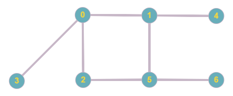
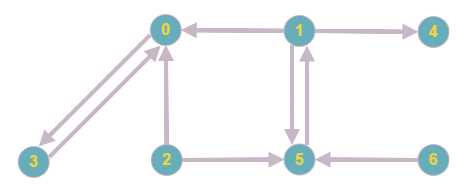

# Graph

* [Adjacency List](#adj_list)
* [Adjacency Matrix](#adj_matrix)

A graph is a set of nodes that are (or not) connected by edges. These edges can have attributes, such as a weight or color.

* Graphs can be undirected or directed (digraph). In an undirected graph, any edge acts as a two-way path, but in a directed graph each edge can only be traversed in one direction.

* Graphs can have multiple edges between nodes. A graph of this sort is called a multigraph and the edges are usually differentiated by their attributes (weight, etc.)

* A graph may contain cycles (i.e. a path leading from a node back to itself). Furthermore, graphs may also contain loops (edges from a node to itself).

<p align="center">
  
</p>

<p align="center">
  
</p>

There are two common ways of designing a graph data structure; adjacency lists (more common) and adjacency matrices.

## <a name="adj_list"></a> Adjacency List

In an adjacency list, every vertex keeps track of it's neighboring/adjacent vertices in a list. When the graph is undirected, an edge (u, v) is stored twice: once in u's list and once in v's list. Oftentimes, a dictionary or hash table is used for vertex access.

```python
class Graph:
    def __init__(self, adj_list={}, directed=False):
        self._adj = defaultdict(dict)
        self._directed = directed
        self.add_edges(adj_list=adj_list)

    def __getitem__(self, vertex):
        if vertex not in self._adj:
            raise KeyError

        return self._adj[vertex]

    def __delitem__(self, vertex):
        del self._adj[vertex]
        for u, adj in self._adj.items():
            if vertex in self._adj[u]:
                del self._adj[u][vertex]

    def __len__(self):
        return len(self._adj)

    def add_edges(self, adj_list={}):
        for u, adj in adj_list.items():
            for v, attr in adj.items():
                self.add_edge(u, v, attr)

    def add_edge(self, u_of_edge, v_of_edge, attributes={}):
        if u_of_edge in self._adj and v_of_edge in self._adj[u_of_edge]:
            raise Exception

        self._adj[u_of_edge][v_of_edge] = attributes
        self._adj[v_of_edge]
        if not self._directed and u_of_edge != v_of_edge:
            self._adj[v_of_edge][u_of_edge] = attributes
```

## <a name="adj_matrix"></a> Adjacency Matrix

To-Do
